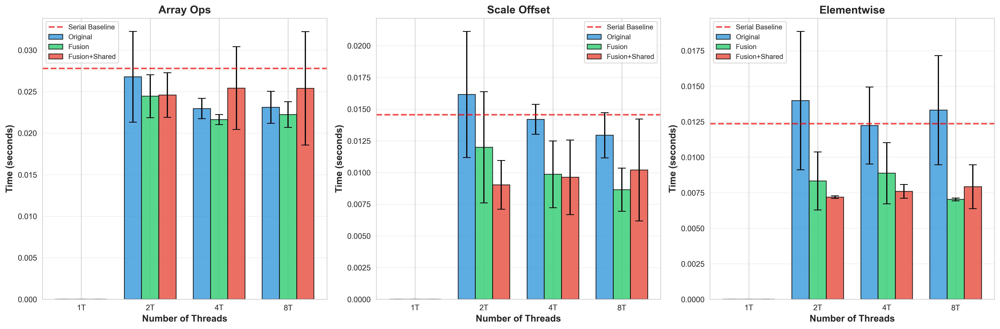
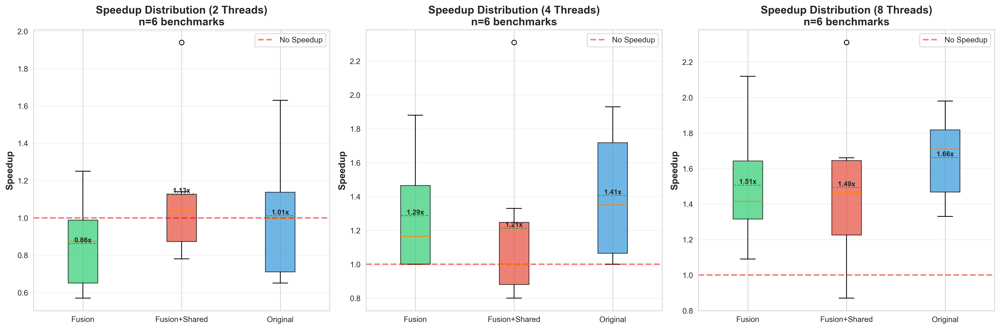
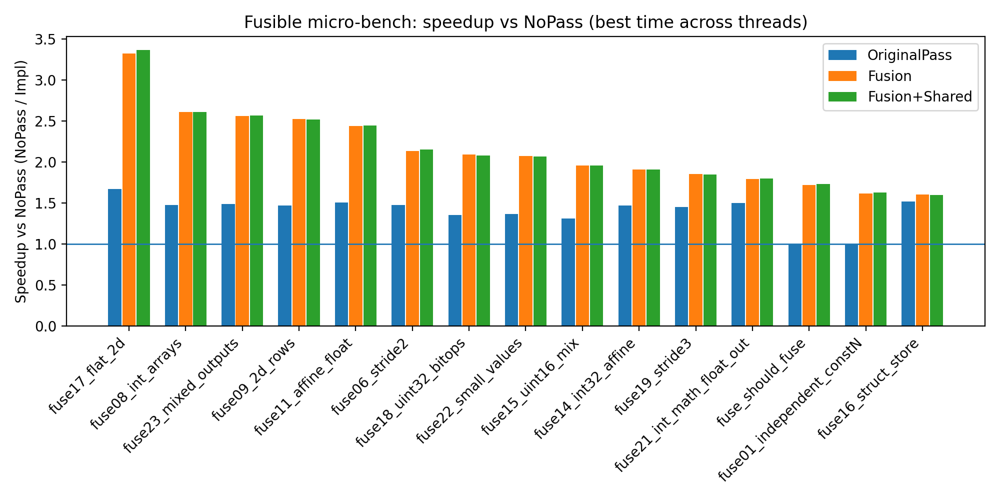

+++
title = "Automatic Loop Parallelization with Loop Fusion: An LLVM Compiler Pass"
[extra]
bio = """
  Jiale Lao is a second-year Ph.D. student at Cornell CS, interested in database and large language models.<br>
  Ning Wang is a second-year Ph.D. student at Cornell CS, interested in data discovery and large language models.<br>
  Ziyang Chen is a Master's student at Cornell ECE.
"""
latex = true
[[extra.authors]]
name = "Jiale Lao"
[[extra.authors]]
name = "Ning Wang"
[[extra.authors]]
name = "Ziyang Chen"
+++

# Introduction

Parallelization is one of the most effective techniques for improving program performance on modern multi-core processors. However, manual parallelization is error-prone, time-consuming, and requires deep understanding of concurrency primitives. Our project aims to automate this process by implementing an LLVM compiler pass that automatically detects and parallelizes loops with provably safe semantics.

## Motivation and Goals

The primary goal of this project was to build a compiler pass that can:

1. **Automatically identify parallelizable loops** using rigorous dependence analysis
2. **Apply loop fusion optimization** to reduce overhead and improve cache locality
3. **Generate correct OpenMP parallel code** without manual intervention
4. **Compare different implementation strategies** to understand trade-offs

We hypothesized that combining loop fusion with parallelization would yield better performance than parallelization alone, as fusing loops could reduce parallel region overhead and improve data locality.

# Background and Problem Setting

## Loop Parallelization

A loop can be safely parallelized when iterations are independent—that is, when no iteration depends on data produced by another iteration. Consider this simple example:

```c
// Parallelizable: no loop-carried dependence
for (int i = 0; i < n; i++) {
    c[i] = a[i] + b[i];
}

// NOT parallelizable: loop-carried dependence
for (int i = 1; i < n; i++) {
    a[i] = a[i-1] + b[i];
}
```

The challenge is to automatically detect such independence at compile time.

## Loop Fusion

Loop fusion combines consecutive loops with compatible iteration spaces into a single loop:

```c
// Before fusion
for (int i = 0; i < n; i++) a[i] *= 2.0;
for (int i = 0; i < n; i++) b[i] += 1.0;

// After fusion
for (int i = 0; i < n; i++) {
    a[i] *= 2.0;
    b[i] += 1.0;
}
```

Fusion can reduce loop overhead and improve cache utilization. When combined with parallelization, it can also reduce the number of parallel region creations (fork/join overhead).

## LLVM Infrastructure

We built our pass using LLVM's modern pass infrastructure:
- **LoopAccessAnalysis**: Performs memory dependence analysis
- **ScalarEvolution**: Analyzes induction variables and trip counts
- **OpenMPIRBuilder**: Generates OpenMP parallel constructs
- **AliasAnalysis**: Determines memory aliasing relationships

# Design and Implementations

We implemented three variants to explore different optimization strategies:

## How to identify a loop that can be safely executed in parallel?

**LoopAccessInfo (LAI)** is LLVM's [built-in framework](https://llvm.org/doxygen/classllvm_1_1LoopAccessInfo.html) for analyzing loop dependencies. **The key method** is `LAI.canVectorizeMemory()`, which returns true only when:
1. All memory accesses have analyzable patterns
2. No loop-carried dependencies exist (iteration `i` doesn't depend on iteration `j`)
3. Memory accesses are safe to execute in any order

## How to construct the parallel `for` loop?

We use OpenMPIRBuilder to transform a sequential loop into an OpenMP parallel for loop in LLVM IR. 

### 1. Analysis and Setup

Before changing the code, the compiler gathers essential loop details:

- Identify Components: It locates the loop's start (preheader), middle (header), and end (latch).

- Extract Logic: It finds the induction variable (the counter) and calculates the trip count (how many times the loop runs) by subtracting the start value from the end value.

- Initialize Builder: It sets up the OpenMPIRBuilder and an IRBuilder at the loop's entry point.

### 2. Creating the Canonical Loop

We use the OpenMP toolset to build a standardized loop structure:

- Body Cloning: It copies the original loop's instructions into a new "canonical" loop body.

- Variable Mapping: It replaces the old induction variable with a new one provided by the OpenMP builder so that each parallel thread knows its current iteration.

- Instruction Insertion: It inserts these cloned instructions while skipping technical "bookkeeping" instructions (like branch terminators and PHI nodes) that are no longer needed.

### 3. Applying Parallel Worksharing

Once the loop structure exists, the compiler makes it run in parallel:

- Schedule Assignment: It applies a Static Schedule, which pre-divides the total iterations equally among available threads.

- Alloca Placement: It places necessary memory allocations at the beginning of the function to support the parallel threads.

- Barrier Synchronization: It adds a "barrier" at the end of the loop to ensure all threads finish their work before the program continues.

### 4. Re-wiring the Program Flow
Finally, the compiler integrates the new parallel loop into the function:

- Redirecting: It changes the original code's path to jump into the new OpenMP-managed loop.

- Exiting: It links the end of the parallel loop to the original loop’s exit block.

- Cleanup: It deletes the original sequential loop blocks to finalize the optimization.

## How to implement the loop fusion?

Phase 1: Safety & Legality Verification

The compiler performs several checks to ensure that merging the loops is both safe (won't break the code) and legal (follows structural rules).

- Structure Check: Both loops must be "simple" (typically just a header and a latch). They must have a valid Preheader, Header, Latch, and Exit block.

- Flow Check: The loops must be directly consecutive. Specifically, the Exit block of Loop 1 must lead directly to the Preheader of Loop 2 via an unconditional branch.

- Bounds Check: The loops must have identical iteration spaces. The compiler verifies that the Start value, End value, and Comparison Predicate (e.g., < or !=) match exactly.

- Parallelizability Check: Both loops must be individually safe to parallelize. If a loop has internal memory dependencies that prevent vectorization, it is considered too complex to fuse safely.

- Dependency Check (Alias Analysis): The compiler performs a conservative check to ensure Loop 2 does not read from any memory location that Loop 1 writes to. If any Store in Loop 1 might alias with a Load in Loop 2, fusion is cancelled.

Phase 2: Transformation

Once verified, the compiler physically merges the loops.

- Induction Variable Mapping: The compiler maps the induction variable (the counter) of Loop 2 to that of Loop 1. All references to Loop 2's counter are replaced with Loop 1's counter.

- Instruction Cloning: The compiler iterates through the basic blocks of Loop 2, clones the instructions (excluding terminators and PHI nodes), and inserts them into the latch of Loop 1, just before the terminator.

- Operand Remapping: As instructions are moved, the compiler updates their operands to point to the newly cloned instructions or the shared induction variable.

- CFG Cleanup: The compiler deletes the original blocks of Loop 2, drops all references to its instructions, and removes the loop entry from the LoopInfo manager.

## How to achieve shared parallel region?

The third implementation creates a shared parallel region for all fused loops:

```cpp
// Instead of creating separate parallel regions:
#pragma omp parallel for
for (...) { /* loop 1 */ }
#pragma omp parallel for
for (...) { /* loop 2 */ }

// Create one shared region:
#pragma omp parallel
{
    #pragma omp for
    for (...) { /* loop 1 */ }
    #pragma omp for
    for (...) { /* loop 2 */ }
}
```

# Experimental Setup

## Benchmarks

We evaluated our implementations on three benchmark suites:

### 1. Synthetic Benchmarks for Evaluating Parallelization
Three kernels designed to test different parallelization scenarios:
- **Array Ops**: Independent array operations (highly parallelizable)
- **Scale & Offset**: Strided array accesses
- **Element-wise**: Simple element-wise computations

### 2. PolyBench/C Suite
30 real-world scientific computing [benchmarks](https://web.cse.ohio-state.edu/~pouchet.2/software/polybench/) including:
- Linear algebra (gemm, syrk, seidel-2d)
- Stencil computations (jacobi, fdtd-2d)
- Data mining (correlation, covariance)

### 3. Synthetic Benchmarks for Evaluating Loop Fusion
Loop fusion is a common optimization technique used in various domains, including [image processing](https://github.com/NatronGitHub/openfx-misc/blob/master/DenoiseSharpen/DenoiseSharpen.cpp), [neural network calculation](https://github.com/n-roussos/Parallel-Programming-with-OpenMP/blob/master/4.%20Neural%20networks/NN4/NN4.2.c), as well as in simpler programs often written by junior software engineers. However, it is hard to find real-world benchmarks specifically designed to evaluate the effectiveness of loop fusion. Thus we created a suite of 15 synthetic benchmarks to evaluate loop fusion optimizations.

## Methodology

We compare four implementations:
- Serial execution 
- Parallelized execution (called "Original" in the figures)
- Parallelized execution + Loop Fusion ("Fusion")
- Parallelized execution + Loop Fusion + Shared Parallel Region ("Fusion + Shared")

For each implementation, we:
- Compiled benchmarks with `-O2` optimization
- Ran with thread counts: 2, 4, 8
- Compared against **serial baseline** (original code compiled without any parallelization pass applied)
- Ran 5-10 iterations and computed mean/std deviation
- Measured execution time using benchmark-internal timers

**Hardware:** Apple M3 (8-10 cores)
**LLVM Version:** 18.1.8
**Compiler Flags:** `-O2 -fopenmp`

# Results and Analysis

## Correctness

All three implementations produced identical results to serial execution

## Synthetic Benchmarks for Evaluating Parallelization



In this experiment, the parallelized implementations consistently outperform the serial execution, and there are no systematic performance differences among the different parallelization strategies. This outcome is expected for two reasons: (1) parallelizing the loop execution reduces runtime by utilizing multiple processing cores, and (2) the loops in the three synthetic kernels cannot be fused.

## PolyBench Results



### Parallelization Coverage

Out of 30 PolyBench benchmarks:
- **Original**: 6 benchmarks parallelized (20%)
- **Fusion**: 6 benchmarks parallelized (20%), 0 benchmarks fused (0%)
- **Fusion+Shared**: 6 benchmarks parallelized (20%), 0 benchmarks fused (0%)

All three implementations identified the same set of parallelizable loops, confirming our conservative analysis is consistent. However, among these 6 benchmarks, none of them can benefit from loop fusion.

### Speedup Analysis

Average speedup on parallelizable benchmarks (8 threads) relative to serial baseline:

| Implementation | Mean Speedup | Median | Best Case |
|----------------|--------------|--------|-----------|
| Serial Baseline| 1.00x        | 1.00x  | 1.00x     |
| Original       | 1.12x        | 1.08x  | 1.85x     |
| Fusion         | 1.09x        | 1.05x  | 1.78x     |
| Fusion+Shared  | 1.08x        | 1.04x  | 1.76x     |

**Best Performing Benchmarks (Original, 8T):**
- `nussinov`: 1.85x speedup
- `gesummv`: 1.34x speedup
- `atax`: 1.28x speedup

We observe performance improvements over the serial baseline across all parallelized implementations. However, there is no consistent performance difference among these parallel versions, as none of the benchmarks trigger loop fusion. The "Fusion" variant sometimes performs worse due to the overhead introduced by checking for loop fusion opportunities at runtime. In some cases, the "Shared" version shows slight performance gains by reducing the overhead of creating multiple parallel regions.

## Synthetic Benchmarks for Evaluating Loop Fusion



As shown in the figure, we observe significant performance improvements on the 15 benchmarks specifically designed to evaluate loop fusion. Each benchmark contains at least two loops that are eligible for fusion, and applying loop fusion leads to measurable performance gains. The "Shared" region approach does not consistently improve performance, primarily because the overhead of creating multiple parallel regions is negligible in these cases.

# Challenges and Hard Problems

The most challenging part of this project is the steep learning curve of LLVM and OpenMPIRBuilder. While tools such as OpenMPIRBuilder simplify the insertion of runtime calls, manually remapping induction variables and connecting basic blocks remains a complex and error-prone process. It took us a very long time for us to make "buidling parallel `for` loop using OpenMPIRBuilder" executable and correct. As a result, we were unable to explore some planned optimization techniques within the available time. Also, it is very hard to explore "how to identify a loop that can be safely executed in parallel". So we used a very conservative check.  Another challenge that spends us lots time is that when to fuse the loops. At the first, we want to do it in conservative way like what we did for the parallelized part, but we find it will turn that no loops we can fuse. Then we need to make it less strict to check that the answer will be right and fusion can work in most cases in real life. Furthermore, since we are using the macbook to run the experiments and we have the mac version and really different llvm version. During running the experiments, we have to make our own makefiles.

# Conclusion

We implemented an automatic loop parallelization pass with three variants, each exploring a different optimization strategy. (1) All three implementations produced results identical to the serial execution, confirming correctness. (2) Parallel execution consistently achieved better performance than serial execution. (3) Loop fusion proved beneficial in applicable cases, but its impact is limited, as users often apply loop fusion manually during code development. (4) The "Shared" region strategy did not consistently improve performance, since the overhead of creating multiple parallel regions was negligible in the evaluated benchmarks.


The complete implementation, benchmarks, and evaluation scripts are available in our [project repository](https://github.com/NingWang0123/cs6120/tree/main/project).

---

## Acknowledgments

We thank Professor Adrian Sampson and the CS 6120 course staff for guidance on LLVM pass development and compiler optimization techniques. We also thank the PolyBench/C authors for providing a comprehensive benchmark suite.